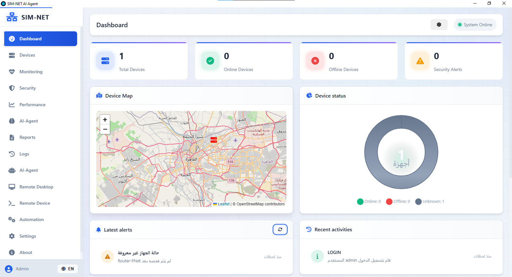
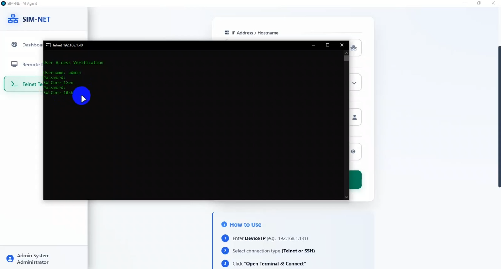
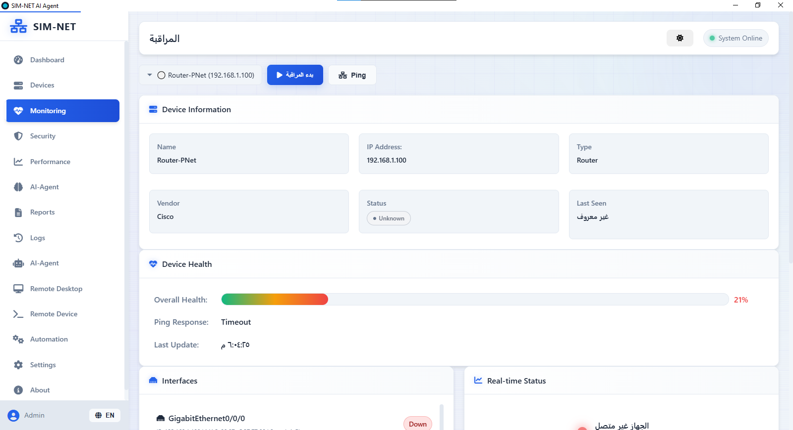
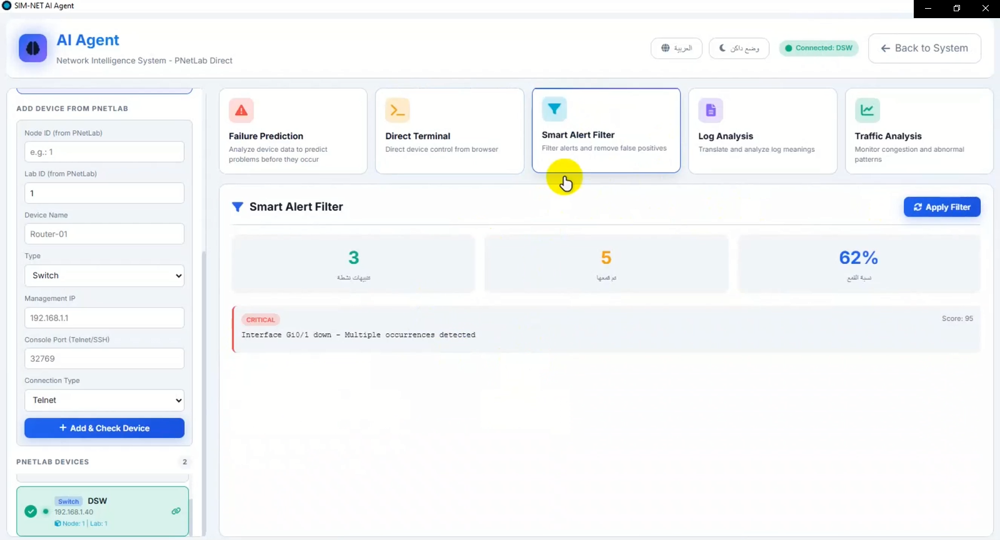
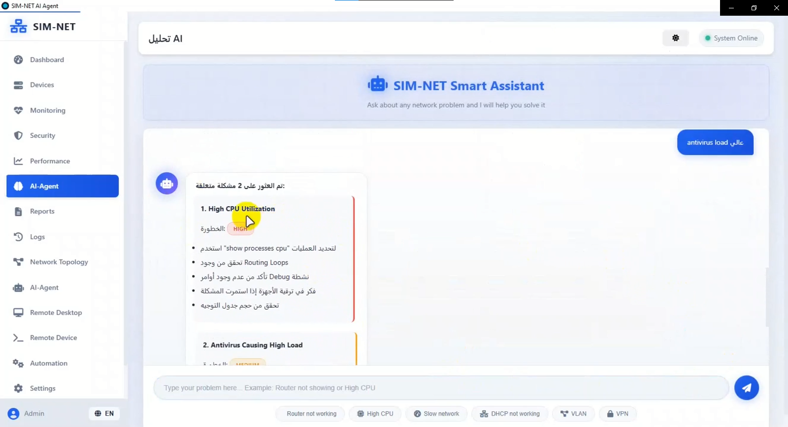
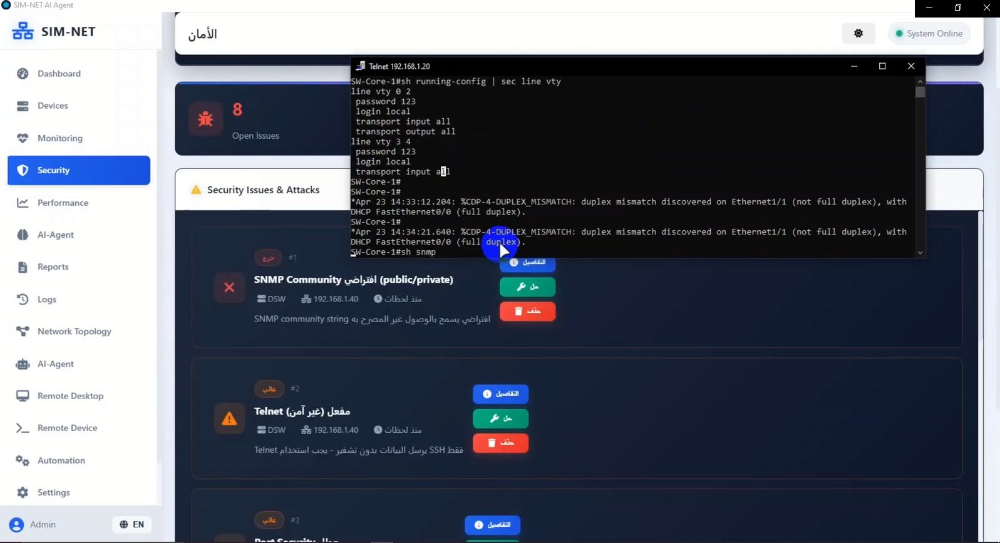
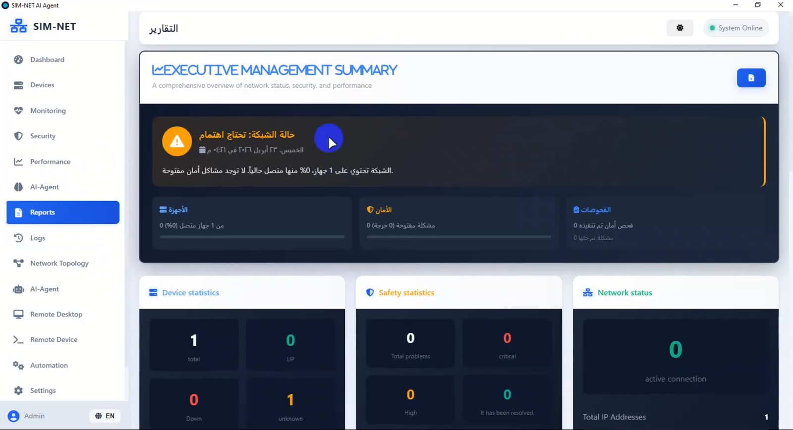

# 🤖 SIM-NET - Smart Network Management System

  

  <b>AI-Powered Network Monitoring, Automation & Security Platform</b>

---

# 📸 System Screenshots

## 🏠 Dashboard

  

### Features

📊 Device Statistics

🟢 Online Devices

🔴 Offline Devices

⚠ Critical Alerts

📈 Performance Monitoring

---

## 🖥 Device Management

  

### Capabilities

🔍 Device Discovery

📡 CDP Detection

🖥 Router Management

🔀 Switch Management

🔥 Firewall Management

---

## 📊 Real-Time Monitoring

  

### Monitoring Features

📡 Interface Monitoring

📈 Performance Tracking

🔔 Live Alerts

⚡ Device Status Monitoring

---

## 🤖 AI Analysis Engine

  

### AI Features

🧠 Packet Analysis

📊 Traffic Pattern Analysis

🚨 Threat Detection

💡 Smart Recommendations

---

## 💬 AI Chatbot

  

### Chatbot Capabilities

🔍 Troubleshooting Assistance

📚 Knowledge Base Search

⚙ Configuration Guidance

🛡 Security Recommendations

---

## 🔒 Security Center

  

### Security Features

🛡 Security Auditing

🚨 Threat Detection

📋 ACL Management

⚠ Risk Assessment

---

## 📈 Reports & Analytics

  

### Available Reports

📅 Daily Reports

📅 Weekly Reports

📅 Monthly Reports

📊 Performance Reports

🛡 Security Reports

---

# 🚀 Project Overview

SIM-NET (Smart Intelligent Network Management System) is an enterprise-grade network management platform that combines:

🖥 Device Management

📊 Real-Time Monitoring

⚙ Network Automation

🛡 Security Analysis

🤖 Artificial Intelligence

📈 Reporting & Analytics

into a single centralized dashboard.

The platform helps network engineers and system administrators automate repetitive tasks, improve visibility, strengthen security, and simplify infrastructure management.

---

# 🌟 Key Features

### 🖥 Device Management

* Router Management
* Switch Management
* Firewall Management
* Server Monitoring
* Interface Monitoring

### 📊 Monitoring

* Real-Time Monitoring
* Device Health Tracking
* Live Alerts
* Performance Metrics

### ⚙ Automation

* Self-Healing Operations
* Auto Recovery
* Configuration Validation
* Baseline Comparison

### 🛡 Security

* Security Auditing
* Threat Detection
* ACL Analysis
* Risk Assessment

### 🤖 AI Engine

* Packet Analysis
* Traffic Analysis
* Smart Recommendations
* AI Chatbot

### 📈 Reporting

* Interactive Dashboards
* Security Reports
* Performance Reports
* Export Capabilities

---

# 🛠 Technologies Used

🐍 Python

⚡ Flask

🌐 HTML5

🎨 CSS3

📜 JavaScript

🤖 AI Engine

🛡 Security Modules

📡 Network Monitoring

🔄 Automation Framework

---

# 👨‍💻 Author

Ahmed

🌐 Network Engineer

⚙ Network Automation

🐍 Python Developer

🛡 Cyber Security

🤖 AI Integration

🚀 Infrastructure Management

---

⭐ Star the repository if you found it useful.
